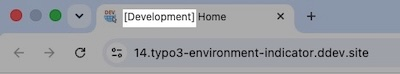
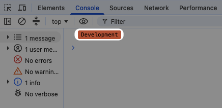
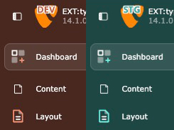
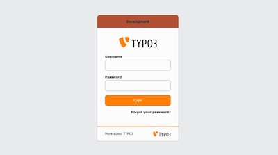
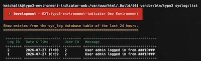
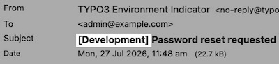

<div align="center">


# TYPO3 extension `typo3_environment_indicator`

[](https://extensions.typo3.org/extension/typo3_environment_indicator)

[](https://coveralls.io/github/konradmichalik/typo3-environment-indicator)
[](https://github.com/konradmichalik/typo3-environment-indicator/actions/workflows/cgl.yml)
[](https://github.com/konradmichalik/typo3-environment-indicator/actions/workflows/tests.yml)
[](LICENSE.md)

</div>

This extension provides several features to show an environment indicator in the TYPO3 frontend and backend, and beyond (CLI, mails).

> [!NOTE]
> Has it ever happened to you that you changed data on a test system and then realized: oh no, that's the live system. 
> Well, to prevent that from happening (again), I created this extension.


## ✨ Features

<table>
  <thead>
    <tr>
      <th>Icon</th>
      <th>Preview</th>
      <th>Feature</th>
    </tr>
  </thead>
  <tbody>
    <tr>
      <th colspan="3" align="left">Frontend + Backend</th>
    </tr>
    <tr>
      <td></td>
      <td></td>
      <td><strong><a href="https://docs.typo3.org/p/konradmichalik/typo3-environment-indicator/main/en-us/Indicators/Favicon.html">Modified favicon</a></strong><br/><br/>Modify the favicon for frontend and backend based on the original favicon, the current application context and your configuration.</td>
    </tr>
    <tr>
      <td></td>
      <td></td>
      <td><strong><a href="https://docs.typo3.org/p/konradmichalik/typo3-environment-indicator/main/en-us/Indicators/PageTitle.html">Page title</a></strong><br/><br/>Prefix or suffix the page title in frontend and backend with the current application context.</td>
    </tr>
    <tr>
      <th colspan="3" align="left">Frontend</th>
    </tr>
    <tr>
      <td></td>
      <td></td>
      <td><strong><a href="https://docs.typo3.org/p/konradmichalik/typo3-environment-indicator/main/en-us/Indicators/FrontendHint.html">Frontend hint</a></strong><br/><br/>Adds an informative hint to the frontend showing the website title and the current application context.</td>
    </tr>
    <tr>
      <td></td>
      <td></td>
      <td><strong><a href="https://docs.typo3.org/p/konradmichalik/typo3-environment-indicator/main/en-us/Indicators/FrontendImage.html">Modified frontend image</a></strong><br/><br/>Modify frontend image based on the original image, the current application context and your configuration.</td>
    </tr>
    <tr>
      <td></td>
      <td></td>
      <td><strong><a href="https://docs.typo3.org/p/konradmichalik/typo3-environment-indicator/main/en-us/Indicators/Console.html">Browser console badge</a></strong><br/><br/>Print a styled environment badge to the browser console on page load.</td>
    </tr>
    <tr>
      <th colspan="3" align="left">Backend</th>
    </tr>
    <tr>
      <td></td>
      <td></td>
      <td><strong><a href="https://docs.typo3.org/p/konradmichalik/typo3-environment-indicator/main/en-us/Indicators/BackendToolbar.html">Backend toolbar item</a></strong><br/><br/>Adds an informative item with the current application context to the backend toolbar.</td>
    </tr>
    <tr>
      <td></td>
      <td></td>
      <td><strong><a href="https://docs.typo3.org/p/konradmichalik/typo3-environment-indicator/main/en-us/Indicators/BackendTopbar.html">Backend topbar</a></strong><br/><br/>Colorize the backend header topbar regarding the application context.</td>
    </tr>
    <tr>
      <td></td>
      <td></td>
      <td><strong><a href="https://docs.typo3.org/p/konradmichalik/typo3-environment-indicator/main/en-us/Indicators/BackendLogo.html">Modified backend logo</a></strong><br/><br/>Modify the backend logo based on the original logo, the current application context and your configuration.</td>
    </tr>
    <tr>
      <td></td>
      <td></td>
      <td><strong><a href="https://docs.typo3.org/p/konradmichalik/typo3-environment-indicator/main/en-us/Indicators/DashboardWidget.html">Dashboard widget</a></strong><br/><br/>Render a dashboard widget according to the environment.</td>
    </tr>
    <tr>
      <td></td>
      <td></td>
      <td><strong><a href="https://docs.typo3.org/p/konradmichalik/typo3-environment-indicator/main/en-us/Indicators/BackendTheme.html">Backend theme</a></strong> <em>(experimental)</em><br/><br/>Colorize the entire TYPO3 v14+ backend (primary color, header, sidebar) based on the environment.</td>
    </tr>
    <tr>
      <td></td>
      <td></td>
      <td><strong><a href="https://docs.typo3.org/p/konradmichalik/typo3-environment-indicator/main/en-us/Indicators/BackendLogin.html">Backend login</a></strong><br/><br/>Show a colored environment badge directly on the backend login screen.</td>
    </tr>
    <tr>
      <th colspan="3" align="left">Misc</th>
    </tr>
    <tr>
      <td></td>
      <td></td>
      <td><strong><a href="https://docs.typo3.org/p/konradmichalik/typo3-environment-indicator/main/en-us/Indicators/CliBanner.html">CLI banner</a></strong><br/><br/>Print a colored environment banner to stderr before an interactive console command runs.</td>
    </tr>
    <tr>
      <td></td>
      <td></td>
      <td><strong><a href="https://docs.typo3.org/p/konradmichalik/typo3-environment-indicator/main/en-us/Indicators/MailSubjectPrefix.html">Mail subject prefix</a></strong><br/><br/>Prepends the environment to the subject of every mail sent through the TYPO3 Mailer API.</td>
    </tr>
  </tbody>
</table>

> [!NOTE]
> These environment indicators are mainly for development purposes (e.g. distinguishing between different test systems)
> and will not show on the live production site. They do show in `Production/Staging` and `Production/Standby`
> application contexts, where they help distinguish those systems from the live site.

## 🔥 Installation

### Requirements

| Version | TYPO3       | PHP          |
|---------|-------------|--------------|
| 3.x     | 13.4 - 14.x | 8.2 - 8.5    |
| 2.x     | 11.5 - 13.4 | 8.1 - 8.4    |

### Composer

[](https://packagist.org/packages/konradmichalik/typo3-environment-indicator)
[](https://packagist.org/packages/konradmichalik/typo3-environment-indicator)

Use the following composer command to install the extension:

```bash
composer require konradmichalik/typo3-environment-indicator
```

### TER

[](https://extensions.typo3.org/extension/typo3_environment_indicator)
[](https://extensions.typo3.org/extension/typo3_environment_indicator)

Download the zip file
from [TYPO3 extension repository (TER)](https://extensions.typo3.org/extension/typo3_environment_indicator).

## 📙 Documentation

Please have a look at the
[official extension documentation](https://docs.typo3.org/p/konradmichalik/typo3-environment-indicator/main/en-us/Index.html).

## 🧑‍💻 Contributing

Please have a look at [`CONTRIBUTING.md`](CONTRIBUTING.md).

## 💎 Credits

This project is partly inspired by the [laravel-favicon](https://github.com/beyondcode/laravel-favicon) package.

## ⭐ License

This project is licensed
under [GNU General Public License 2.0 (or later)](LICENSE.md).
